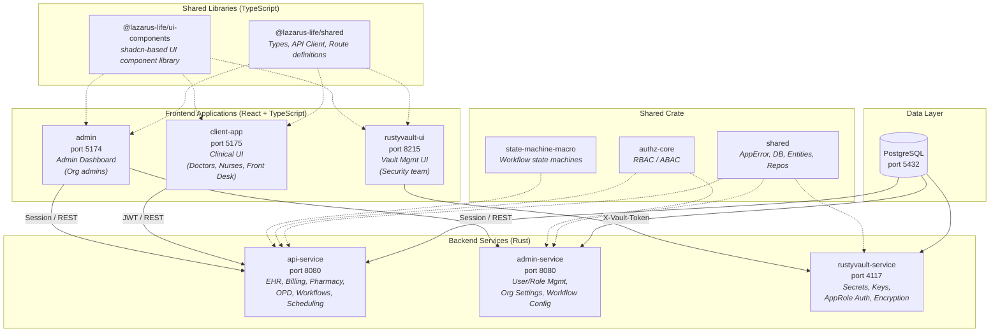

# Architecture Overview

Health V1 is a healthcare platform built as a monorepo combining Rust backend services with TypeScript/React frontend applications. The system is designed for clinical workflows including electronic health records (EHR), billing, pharmacy management, scheduling, and organizational administration.

## System Diagram

## Backend Services (Rust)

The backend is composed of four Rust crates organized as a Cargo workspace, plus two supporting crates.

### api-service

The main REST API serving all client-facing operations. Runs on port 8080 using the Axum 0.8 framework. Handles:

- **EHR**: Patient records, encounters, vital signs, lab tests, clinical notes, problem lists, imaging orders, anatomy findings, body systems
- **Billing**: Invoices, payments, service catalog
- **Pharmacy**: Prescriptions, drug allergies, medication management
- **Workflows**: Workflow definitions, instances, tasks, visual workflow designer
- **Scheduling**: OPD queue management, appointments
- **Analytics**: Reporting and data aggregation

### admin-service

An administration API for organization-level management. Provides endpoints for:

- User and role management
- Organization settings
- Workflow configuration
- Department management
- System-wide policy administration

### rustyvault-service

A HashiCorp Vault-compatible secrets management service running on port 4117. Provides:

- Secrets storage and retrieval
- Encryption key management with DEK rotation
- AppRole authentication
- UserPass authentication
- Token-based authentication
- Policy management
- Realm and app store management
- Audit logging for all secret operations

### shared

A common library crate consumed by all backend services. Contains:

- **AppError**: Unified error types with structured logging support
- **Database service**: SQLx-based PostgreSQL connection management with compile-time query verification
- **Domain entities**: Shared data models (patients, encounters, workflows, etc.)
- **Repository traits and implementations**: Async repository pattern for data access
- **Infrastructure layer**: Database implementations of repository traits

### authz-core

An authorization engine that supports both Role-Based Access Control (RBAC) and Attribute-Based Access Control (ABAC) policies. Evaluates access decisions based on user roles, resource attributes, and organizational context.

### state-machine-macro

A procedural macro crate that generates state machines from configuration. Used for workflow state management, allowing declarative definition of states, transitions, and guards.

## Frontend Applications (TypeScript/React)

Three frontend applications share common libraries via a Bun workspace monorepo.

### client-app (port 5175)

The primary clinical application used by doctors, nurses, and front desk staff. Provides interfaces for patient management, encounter documentation, order entry, results review, and clinical workflows.

### admin (port 5174)

The organization administration dashboard for managing users, roles, departments, and system configuration.

### rustyvault-ui (port 8215)

A dedicated interface for vault management, allowing security teams to manage secrets, encryption keys, policies, and authentication methods.

### Shared Libraries

- **@lazarus-life/shared**: Common TypeScript types, the `BaseApiClient` with three authentication strategies (JWT, session cookies, vault tokens), and centralized API route definitions.
- **@lazarus-life/ui-components**: A reusable UI component library built on shadcn/ui, providing consistent design across all three applications.

## Technology Stack

| Layer | Technology |
|-------|-----------|
| Backend Framework | Axum 0.8, Tower middleware |
| Backend Language | Rust |
| Database | PostgreSQL |
| Database Driver | SQLx (compile-time verified queries) |
| Frontend Framework | React with TypeScript |
| Routing | TanStack Router (file-based) |
| Server State | TanStack Query |
| Client State | Zustand |
| Styling | Tailwind CSS |
| Desktop Builds | Tauri |
| Package Manager | Bun |
| Orchestration | Docker Compose |
| Error Handling | thiserror, anyhow |
| Logging | tracing (structured) |

## Orchestration

All services are orchestrated via Docker Compose. Three compose configurations exist:

- **docker-compose.yml**: Production configuration
- **docker-compose.dev.yml**: Development configuration with hot-reload support
- **docker-compose.test.yml**: Test environment with isolated database

The `Makefile` at the project root serves as the universal interface for all development operations. All commands (build, test, lint, deploy) are accessible from the project root without needing to change directories.

## Key Design Decisions

1. **Monorepo**: All services and applications live in a single repository, enabling atomic cross-cutting changes and shared tooling.

2. **Compile-time SQL verification**: SQLx macros verify all SQL queries against the live database schema at build time, catching SQL errors before runtime.

3. **Repository pattern**: Domain entities define traits; infrastructure provides implementations. This separates business logic from data access concerns.

4. **Three auth strategies**: Each frontend application uses the authentication method best suited to its use case (JWT for clinical, sessions for admin, vault tokens for secrets management).

5. **Tiger Style engineering**: The codebase follows strict reliability principles inspired by TigerBeetle, including mandatory error handling, assertion density requirements, function size limits, and bounded resource usage.
